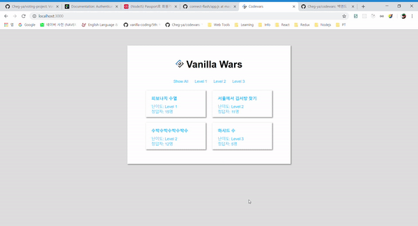

# Codewars
등록되어 있는 **알고리즘 문제**를 풀 수 있는 어플리케이션입니다.

<p align="center">
  
</p>

## Setup

```sh
 npm install
```
  
## Development

```sh
 npm run dev
 visit localhost:3000
```

## Features

### 1. GET `/`

  - `/views/index.ejs` template을 이용해 문제를 보여줍니다.
  - Level 1,2,3에 해당하는 탭을 눌렀을때, 해당 레벨에 속하는 문제들만 필터링할 수 있습니다.
  - 리스트의 각 문제들을 눌렀을때, `/problems/:problem_id` 페이지로 이동합니다.

### 2. GET `/problems/:problem_id`

  - `problem_id`에 해당하는 id값을 가진 문제의 설명을 화면에 보여줍니다.
    - [ ] 문제 이름
    - [ ] 정답자 수
    - [ ] 문제 레벨
    - [ ] 문제 설명
  - 해당 화면에서 해당 문제에 대한 솔루션을 입력할 수 있는 폼과 정답을 제출할 수 있는 버튼이 있습니다.
  - 해당 폼을 작성하여 "제출" 버튼을 눌렀을때, `POST /problems/:problem_id`로 솔루션 정보를 보냅니다.

### 3. POST `/problems/:problem_id`

  - 해당 문제에 대해 제출받은 답안을 `MongoDB`에 저장되어 있는 테스트 내용을 기반으로 실행하여 정답이 모두 일치하는지 판별합니다.
  - 제출된 코드가 테스트를 모두 통과했을 경우, `success.ejs` 템플릿을 생성하여 축하 메시지를 주고 다시 문제 리스트 화면으로 이동할 수 있는 링크도 표시합니다.
  - 제출된 코드가 테스트를 통과하지 못했을 경우, `failure.ejs` 템플릿을 생성하여 결과를 주고 어떤 테스트가 통과하지 못하였는지에 대한 내용도 표시합니다.
  - 제출된 코드 실행 도중 문제가 발생했을 경우, 발생한 문제에 대한 메시지와 함께 `error.ejs` 템플릿을 보여줍니다.

## Tech
* [NodeJS](https://nodejs.org/api/)
* [Express](https://expressjs.com/)
* [EJS Javascript Template](https://ejs.co/)
* [MonacoEditor](https://github.com/Microsoft/monaco-editor)
* [Mongoose](http://mongoosejs.com/)
* [MonogoDB](https://www.mongodb.com/)
